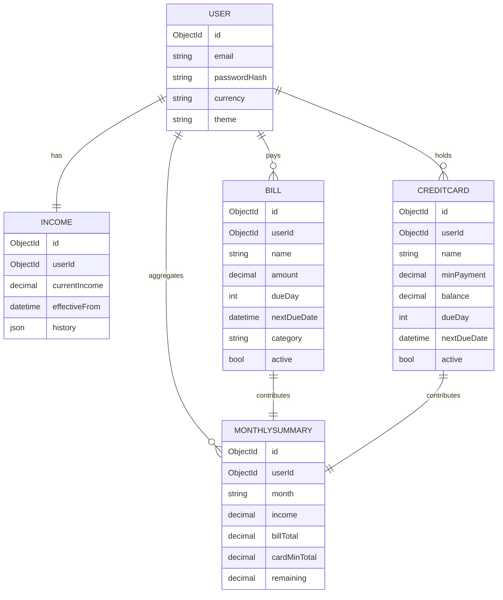

# Data model (simplified)

```mermaid
erDiagram
    USER ||--|| INCOME : has
    USER ||--o{ BILL : pays
    USER ||--o{ CREDITCARD : holds
    USER ||--o{ MONTHLYSUMMARY : aggregates
    BILL ||--|| MONTHLYSUMMARY : contributes
    CREDITCARD ||--|| MONTHLYSUMMARY : contributes

    USER {
      ObjectId id
      string email
      string passwordHash
      string currency
      string theme
    }
    INCOME {
      ObjectId id
      ObjectId userId
      decimal currentIncome
      datetime effectiveFrom
      json history
    }
    BILL {
      ObjectId id
      ObjectId userId
      string name
      decimal amount
      int dueDay
      datetime nextDueDate
      string category
      bool active
    }
    CREDITCARD {
      ObjectId id
      ObjectId userId
      string name
      decimal minPayment
      decimal balance
      int dueDay
      datetime nextDueDate
      bool active
    }
    MONTHLYSUMMARY {
      ObjectId id
      ObjectId userId
      string month
      decimal income
      decimal billTotal
      decimal cardMinTotal
      decimal remaining
    }
```
